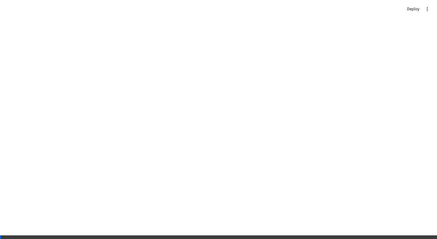

<p align="center">
  
</p>

<h1 align="center">drift-lense</h1>

<p align="center">
  <strong>Your metrics lie. Your embeddings don't.</strong>
</p>

<p align="center">
  <a href="https://pypi.org/project/drift-lense/"></a>
  <a href="https://pypi.org/project/drift-lense/"></a>
  <a href="https://github.com/PRAFULREDDYM/Drift_lens/blob/main/LICENSE"></a>
  <a href="https://github.com/PRAFULREDDYM/Drift_lens/stargazers"></a>
</p>

<p align="center">
  <a href="#quick-start">Quick Start</a> •
  <a href="#why-drift-lens">Why drift-lens?</a> •
  <a href="#detection-methods">Methods</a> •
  <a href="#cli-reference">CLI</a> •
  <a href="#python-api">API</a> •
  <a href="#dashboard">Dashboard</a> •
  <a href="#contributing">Contributing</a>
</p>

---

## The Problem

Your model's accuracy looks fine — until it doesn't. By the time precision drops, your embeddings have been silently drifting for **days**. Traditional monitoring watches the wrong signals: accuracy, loss, and latency are **lagging indicators**. The embedding space is the **leading indicator**, and nobody's watching it.

**drift-lense** detects embedding space drift **days before your accuracy drops** — with zero infra changes.

## Install

```bash
pip install drift-lense
```

## Quick Start

```python
from drift_lens import EmbeddingLogger, DriftDetector

logger = EmbeddingLogger(path="./embeddings", window="1d")
logger.log(embeddings)  # numpy, torch, or list — we handle it

detector = DriftDetector(method="frechet")  # or "mmd" or "topology"
result = detector.compare(baseline_embeddings, current_embeddings)
print(f"Drift score: {result.drift_score:.3f} | Alert: {result.is_drift}")
```

That's it. Five lines. No API keys, no cloud, no YAML files.

---

## Why drift-lens?

| | **drift-lens** | Evidently | Arize |
|---|---|---|---|
| **Topology-aware detection** | ✅ Persistent homology catches cluster merges/splits | ❌ Statistical tests only | ❌ Statistical tests only |
| **Zero infrastructure** | ✅ `pip install` and go — flat files, no DB | ⚠️ Requires dashboard server | ❌ SaaS platform, needs API keys |
| **Embedding-native** | ✅ Built specifically for embedding spaces (FED, MMD, Wasserstein) | ⚠️ Generic feature drift, bolt-on embedding support | ⚠️ General-purpose observability |

---

## Detection Methods

### 1. Fréchet Embedding Distance (FED)
> The FID of embeddings. Fast, interpretable, great first pass.

- Models embeddings as multivariate Gaussians
- Measures: `FED = ‖μ₁ - μ₂‖² + Tr(Σ₁ + Σ₂ - 2·(Σ₁·Σ₂)^½)`
- Numerically stabilized with eigenvalue clipping and covariance regularization
- **Best for**: Quick daily checks, CI/CD gates, dashboards

### 2. Maximum Mean Discrepancy (MMD)
> No Gaussian assumption. Kernel-based. Comes with a p-value.

- RBF kernel with adaptive median-heuristic bandwidth
- Permutation test (200 permutations) for statistical significance
- Detects **non-linear** distribution shifts FED would miss
- **Best for**: Rigorous statistical testing, regulatory compliance

### 3. Topological Drift Detection 🧬
> **Our moat.** No other production drift tool does this.

- Computes persistent homology via Vietoris-Rips filtration (Ripser)
- H₀ features = connected components (cluster count changes)
- H₁ features = loops and holes (structural topology shifts)
- Compares persistence diagrams via Wasserstein distance
- **Best for**: Detecting cluster merges, splits, and structural collapse

---

## CLI Reference

drift-lens ships as a CLI tool. Every command works on parquet snapshot files.

### `drift-lens compare`

Compare two embedding snapshots:

```bash
drift-lens compare \
  --baseline ./snapshots/day1.parquet \
  --current  ./snapshots/day14.parquet \
  --method   frechet \
  --threshold 0.3
```

| Flag | Default | Description |
|---|---|---|
| `--baseline` | *(required)* | Path to baseline snapshot (file or directory) |
| `--current` | *(required)* | Path to current snapshot (file or directory) |
| `--method` | `frechet` | Detection method: `frechet`, `mmd`, `topology` |
| `--threshold` | `0.3` | Alert threshold (0-1) |

### `drift-lens watch`

Continuously monitor a snapshot directory:

```bash
drift-lens watch \
  --snapshots ./snapshots \
  --method mmd \
  --threshold 0.4 \
  --interval 60
```

| Flag | Default | Description |
|---|---|---|
| `--snapshots` | *(required)* | Directory to watch for new parquet files |
| `--method` | `frechet` | Detection method |
| `--threshold` | `0.3` | Alert threshold |
| `--interval` | `60` | Polling interval in seconds |

### `drift-lens report`

Generate a standalone HTML drift report:

```bash
drift-lens report \
  --snapshots ./snapshots \
  --output drift_report.html \
  --method frechet
```

| Flag | Default | Description |
|---|---|---|
| `--snapshots` | *(required)* | Directory containing snapshot parquet files |
| `--output` | `drift_report.html` | Output HTML file path |
| `--method` | `frechet` | Detection method |

### `drift-lens dashboard`

Launch the interactive Streamlit dashboard:

```bash
drift-lens dashboard                    # uses built-in demo data
drift-lens dashboard --snapshots ./data # uses your data
```

| Flag | Default | Description |
|---|---|---|
| `--snapshots` | `None` | Path to snapshots (uses demo data if omitted) |

---

## Python API

### EmbeddingLogger

Log embeddings to disk as time-windowed parquet snapshots:

```python
from drift_lens import EmbeddingLogger

logger = EmbeddingLogger(path="./drift_data", window="1d")  # 1h, 6h, 1d, 7d

# Log from any source — numpy, torch tensors, or plain lists
logger.log(embeddings, metadata={"model": "minilm", "source": "prod"})

# List and load snapshots
files = logger.list_snapshots()
baseline = logger.load_snapshot(files[0])
```

### DriftDetector

Unified interface for all three detection methods:

```python
from drift_lens import DriftDetector

detector = DriftDetector(method="frechet", threshold=0.3)
result = detector.compare(baseline, current)

print(result.drift_score)  # 0.0 - 1.0 (normalized)
print(result.is_drift)     # True/False
print(result.p_value)      # float (MMD only) or None
print(result.details)      # method-specific diagnostics
```

### DriftProjector

Fit-on-baseline / transform-current pattern prevents data leakage:

```python
from drift_lens import DriftProjector

projector = DriftProjector(method="umap", n_components=2)
projector.fit(baseline)
proj_base = projector.transform(baseline)
proj_curr = projector.transform(current)

projector.save("projection.pkl")
projector = DriftProjector.load("projection.pkl")
```

### AlertEngine

Threshold-based alerting with cooldowns and audit trail:

```python
from drift_lens import AlertEngine

engine = AlertEngine(threshold=0.3, cooldown_hours=6, alert_dir="./alerts")
alert = engine.check(result)

print(alert.fired)               # True/False
print(alert.severity)            # low, medium, high, critical
print(alert.recommended_action)  # human-readable next steps
```

---

## Dashboard

The Streamlit dashboard is the demo that sells itself:

```bash
# Quick demo with synthetic data
drift-lens dashboard

# or
streamlit run drift_lens/dashboard.py
```

**Features:**
- 🔬 Side-by-side UMAP projections (baseline vs. current)
- 📈 Drift score timeline with accuracy overlay
- 🚨 Early warning banner ("DETECTED 4 DAYS BEFORE ACCURACY DROP")
- 📊 All three methods compared in tabs (FED, MMD, Topology)
- 🎯 Severity-based recommended actions
- 📋 Full alert history table

---

## How It Works

```
Your Model                    drift-lens
─────────                    ───────────
embeddings ──┐
             │   EmbeddingLogger     DriftDetector
             ├──→ .log()  ──→ .parquet ──→ .compare()
             │                              │
             │                        ┌─────┴─────┐
             │                        │  drift_score │
             │                        │  is_drift    │
             │                        │  p_value     │
             │                        └─────┬─────┘
             │                              │
             │                        AlertEngine
             │                         .check()
             │                              │
             │                    ┌─────────┴────────┐
             │                    │ 🟢 low            │
             │                    │ 🟡 medium         │
             │                    │ 🟠 high           │
             │                    │ 🔴 critical       │
             │                    └──────────────────┘
```

---

## Contributing

We welcome contributions! See [CONTRIBUTING.md](CONTRIBUTING.md) for the full guide.

**Quick version:**

```bash
# Fork & clone
git clone https://github.com/YOUR_USERNAME/Drift_lens.git
cd Drift_lens

# Install in dev mode
pip install -e ".[dev]"

# Run tests
pytest tests/ -v

# Make changes, then PR
```

---

## License

MIT — see [LICENSE](LICENSE).

---

<p align="center">
  <strong>Built by <a href="https://github.com/PRAFULREDDYM">Praful Reddy</a></strong><br>
  <sub>If drift-lens saved you from a production incident, consider giving it a ⭐</sub>
</p>
